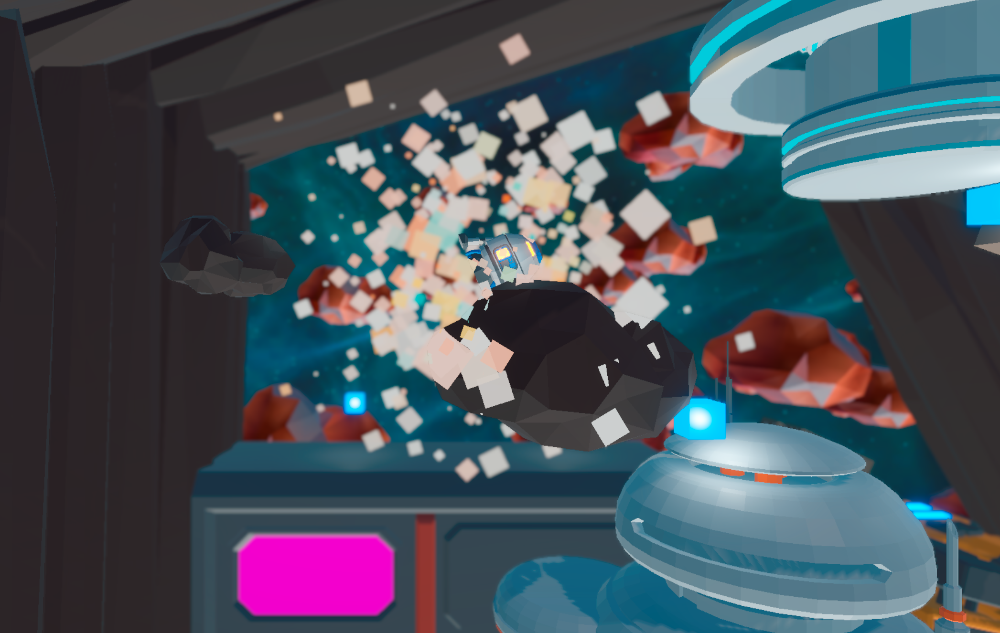

# 🚀 Rocket Boost  

A small physics-based flying prototype made in Unity.  
The player controls a rocket and must reach the finish point without touching any obstacles.  
Simple, clean gameplay focused on physics, movement control and quick reactions.

Playable WebGL version:  
👉 **https://sd7games.itch.io/rocketboost**

---

## 🎮 Gameplay Overview  

The rocket is controlled using physics forces and torque.  
The goal is to fly from **Point A** to **Point B** while avoiding walls, floating objects and level geometry.

### Core Mechanics  
- **Physics-based movement:** thrust, rotation, inertia.  
- **Rigidbody gravity & collisions** using Unity’s physics system.  
- **Obstacle course:** walls, platforms, floating structures.  
- **Level Goal:** reach the landing pad without crashing.  
- **Fast retry loop:** instant restart on collision.  
- **Audio & VFX:** engine sound, collision sound, lighting setup and light post-processing.

---

## 🧠 Tech & Structure  
- Unity  
- C#  
- Rigidbody physics  
- Force-based movement  
- Prefab workflow  
- Simple level design  
- Basic VFX/SFX  
- Lightweight post-processing

---

## 📂 Project Structure
```
/Assets
    /Prefabs
    /Scenes
    /Scripts
        /Player
        /Level
    /Audio
    /Materials
    /Animations
```

---

## 📸 Screenshots  
TO DO


---

## 📸 Screenshots

### 🚀 Early Flight Scene (Start Level)
<p align="center">
  
</p>

### 🔆 Light Simulation & Floating Obstacles
<p align="center">
  
</p>

### 💥 Collision & Destruction (Crash Moment)
<p align="center">
  
</p>


---

## 👨‍💻 Developer  
**Oleksandr Tokarev** — Unity & C# Game Developer based in Finland.  
A small physics prototype created to practice movement, collisions and basic environmental design.


